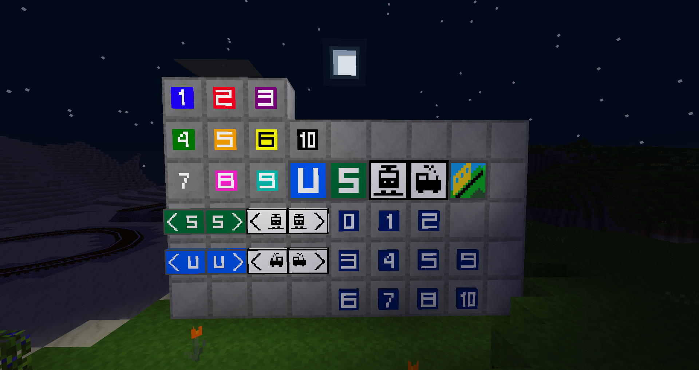

# trainblocks
This mod for minetest adds various signs and blocks related to railways, including crafting recipes for all of them.

Features:

* U-bahn (subway), S-bahn (local train) and railway station signs.
* Signs for platforms 0-10 in dark blue
* Signs for subway lines 1-10 that match the subway cars in
  advtrains\_train\_subway as well as the subway lines on LinuxForks server.
* Mountain railway sign from LinuxForks server.

## History
2018-03-04  version 0.1  release
2018-03-05  version 0.2  added better node registrations and crafting receipes
2018-03-06  version 0.21 added alias
2018-03-07  version 0.3  removed alias in trainblocks and created trainblocks_bc for bachwards-compatibility | added new signs and blocks
2020-05-15  version 0.4

* Added fixed s-bahnblock texture and mod.conf from maxx
* Cleaned up code indentation,
* Added a modern station block with recipes
* Added recipes for station blocks and signs.
* Added platform 0 sign.
* Added a setting to enable/disable crafting recipes.